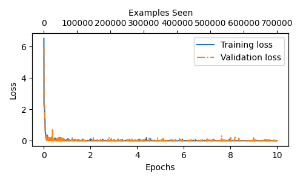
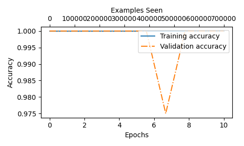

# Commit-Message-Classifier
This project fine-tunes a GPT model on a programmatically generated commit message dataset.

## Overview
### Model Predictions
Given a commit message, the model outputs a numeric label that maps to a specific commit type. Below are example predictions produced by the model:

| Model Prediction   | Message Label       | Commit Message                          | 
|--------------------|---------------------|-----------------------------------------|
| 2                  | docs                | add model prediction examples to README | 
| 3                  | feat                | add new command-line argument           | 
| 6                  | refactor            | update variable and function names      | 


### Training Dataset
The model was trained on a CSV dataset containing 100,001 programmatically generated commit messages. The label distribution is shown in the table below:

| ID    | Label    | Total  |
|-------|----------|--------|
| 0     | build    | 9091   |
| 1     | ci/cd    | 9091   |
| 2     | docs     | 9091   |
| 3     | feat     | 9091   |
| 4     | fix      | 9091   |
| 5     | perf     | 9091   |
| 6     | refactor | 9091   |
| 7     | style    | 9091   |
| 8     | test     | 9091   |
| 9     | chore    | 9091   |
| 10    | revert   | 9091   |

## Usage
Follow the steps below to set up and run the program:

### 1. Clone the Repository
Clone the repository and navigate to the project directory:
```bash
git clone https://github.com/woodsj1206/Commit-Message-Classifier.git
cd Commit-Message-Classifier
```

### 2. Create and Activate a Virtual Environment
Set up a Python virtual environment to manage the project dependencies:
```bash
python -m venv myvenv
source myvenv/Scripts/activate
```

### 3. Install Dependencies
Install all required Python packages using the provided `requirements.txt`:
```bash
pip install -r requirements.txt
```

### 4. Run the Script
Execute the main script:
```bash
python main.py --csv_file_path ./docs/data/commit_messages_dataset.csv --seed 123
```
> [!NOTE]
> The program accepts the following command-line arguments:
> ```
> REQUIRED:
> --csv_file_path CSV_FILE_PATH
>     Path to the CSV file containing text and labels.
>     Expected format: text,label
>
> OPTIONAL:
> --seed SEED
>     Random seed for reproducibility.
>     Default is None.
> 
> --train_fraction TRAIN_FRACTION
>      Fraction of data to use for training (between 0 and 1).
>      Default is 0.7 (70 percent).
> 
> --validation_fraction VALIDATION_FRACTION
>      Fraction of data to use for validation (between 0 and 1).
>      Default is 0.2 (20 percent).
>
>    # The remaining fraction will be used for testing. Default is 0.1 (10 percent).
> 
> --num_workers NUM_WORKERS
>      Number of worker threads for data loading.
>      Default is 0.
> 
> --batch_size BATCH_SIZE
>      Batch size for DataLoader.
>      Default is 8.
> 
> --gpt_model GPT_MODEL
>      GPT-2 model to use.
>      Options include 'gpt2-small-124M.pth', 'gpt2-medium-355M.pth',
>                      'gpt2-large-774M.pth', 'gpt2-xl-1558M.pth'.
>      Default is 'gpt2-small-124M.pth'.
> 
> --last_trf_blocks_to_finetune LAST_TRF_BLOCKS_TO_FINETUNE
>      Number of last transformer blocks to fine-tune.
>      Default is 2.
> 
> --num_epochs NUM_EPOCHS
>      Number of training epochs.
>      Default is 10.
> 
> --lr LR
>      Learning rate for the optimizer.
>      Default is 5e-5.
> 
> --weight_decay WEIGHT_DECAY
>      Weight decay for the optimizer.
>      Default is 0.1.
> 
> --eval_freq EVAL_FREQ
>      Frequency (in steps) for evaluation during training.
>      Default is 50.
> 
> --eval_iter EVAL_ITER
>      Number of batches to use for evaluation.
>      Default is 5.
> 
> --checkpoint_frequency CHECKPOINT_FREQUENCY
>      Frequency (in steps) for saving model checkpoints.
>      Default is 10000.
> 
> --run_tests RUN_TESTS
>      Whether to run example classifications after training.
>      Default is False.
> ```

## Project Structure
The following shows the main file structure of the project with brief descriptions:
```
├── main.py                    # Run the project
├── train.py                   # Training code
├── gpt.py                     # GPT model
├── dataset.py                 # Data loaders
├── utils.py                   # Helper functions
├── results.py                 # Save results
└── requirements.txt           # Required Python packages
```


## Results
Matplotlib visualization of the model’s training results:
| Metric       | Image                        | 
|---------------|-----------------------------------|
| Loss          |  | 
| Accuracy      |  | 


## Acknowledgements & References
This project uses the following external resources:

### Data Sources:
- [commit_messages_dataset.csv](docs/data/commit_messages_dataset.csv) by [woodsj1206](https://github.com/woodsj1206)

### References:
- [Conventional Commits](https://www.conventionalcommits.org/en/v1.0.0/) by [conventionalcommits.org](https://www.conventionalcommits.org/en/v1.0.0/)
- [LLMs-from-scratch](https://github.com/rasbt/LLMs-from-scratch) by [Sebastian Raschka](https://github.com/rasbt)
- [Build a Large Language Model (From Scratch)](https://www.youtube.com/playlist?list=PLTKMiZHVd_2IIEsoJrWACkIxLRdfMlw11) by [Sebastian Raschka](https://www.youtube.com/@SebastianRaschka)


## Development Environment
Tools and technologies used in the development of the project:
- Microsoft Visual Studio Code
- Python 3.13.7
